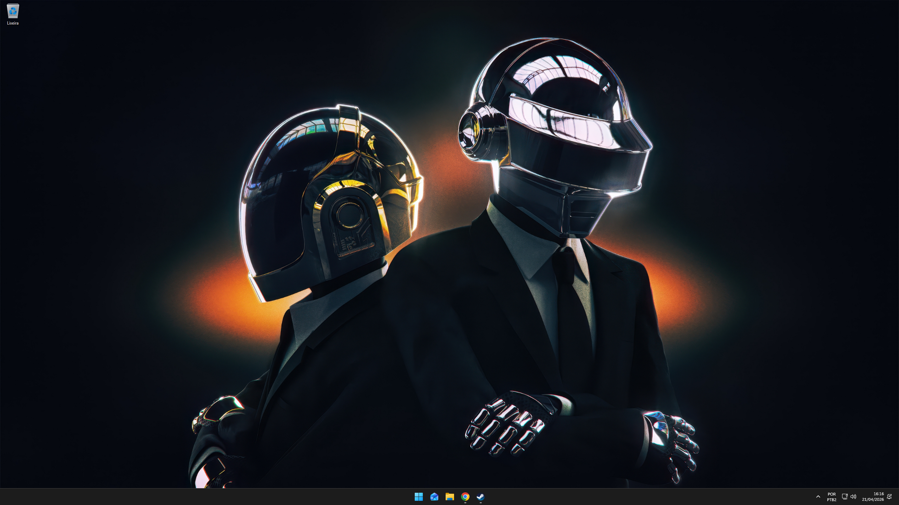

# Configurações do meu Windows 11

Minhas configurações, programas e debloat para deixar o Windows 11 do jeito que eu gosto, muito mais clean, sem IA slop de copilot e outras lixeiras da microsoft.



## 1. Chris Titus Tech's Windows Utility

> Link do git: https://github.com/christitustech/winutil

Este utilitário é uma compilação de tarefas do Windows que realizo em cada sistema Windows que utilizo. Ele visa agilizar instalações, remover programas desnecessários com ajustes, solucionar problemas com configurações e corrigir atualizações do Windows.


### Como Usar:

1. Abra o PowerShell ou Terminal (Windows 11) como administrador;
2. Cole o comando abaixo e precione ENTER;

```bash
irm "https://christitus.com/win" | iex
```

> [!IMPORTANT]
> Aba "install" será os programas que serão baixados  
> Aba "Tweaks" será configurações do Windows

3. Clique na engrenagem > import;
4. Selecione o arquivo **"debloat-config.json"**;
5. Na aba install, clique em **"Install/Upgrade aplications"** e espera a conclusão;
6. Na aba Tweaks, clique em **"Run tweaks"** e espere a conclusão.
7. Pronto! =D

> [!CAUTION]
> Isso desabilita algumas opções que talvez você ache importante,
> leia e desmarque o que você não queira que seja desabilitado!

## 2. Ponteiro do Mouse

Um ponteiro do mouse mais bonito e animado =D


> link original: https://vsthemes.org/en/cursors/black/36701-windows-11-cursors-concept.html

1. Copie a pasta do **cursor** e salve no seu PC;
2. Clique com o botão direito no arquivo "Install.inf" na pasta do tema escolhido e **instalar**;
3. Na aba Ponteiro, selecione o tema instalado na seção **esquema**
4. Clique em **aplicar** e **OK**;
5. Pronto =D

## 3. Spotify sem ad (SpotX)

> link do git: https://github.com/SpotX-Official/SpotX

1. Abra o PowerShell ou Terminal (Windows 11) como **administrador**;
2. Cole o comando abaixo;

```bash
iex "& { $(iwr -useb 'https://raw.githubusercontent.com/SpotX-Official/SpotX/refs/heads/main/run.ps1') } -new_theme"
```

3. Reponda as perguntas de acordo com suas preferências;
4. Aproveite! =D

## 4. Importando perfis do Afterbuner e Rivaturner (Overlay para jogos)

Meu perfil do MSI Afterburner e RivaTuner com overlay customizado exibindo FPS, uso e temperatura de GPU/CPU, e uso de memória RAM.

> Caso tenha seguido os passos, o MSI Afterburner e RivaTurner já estarão instalados.


1. Copie todos os arquivos da pasta **"./backups/afterburner"** e cole em **"C:\Program Files (x86)\MSI Afterburner\Profiles"**;
2. Copie todos os arquivos da pasta **"./backups/rivaturner"** e cole em **"C:\Program Files (x86)\RivaTuner Statistics Server\Profiles"**.
3. Pronto! =D

> Atalho **END** para ativar/desativar overlay, **PgUp** e **PgDn** para alterar e **CTRL+END** para travar a 60 fps.
