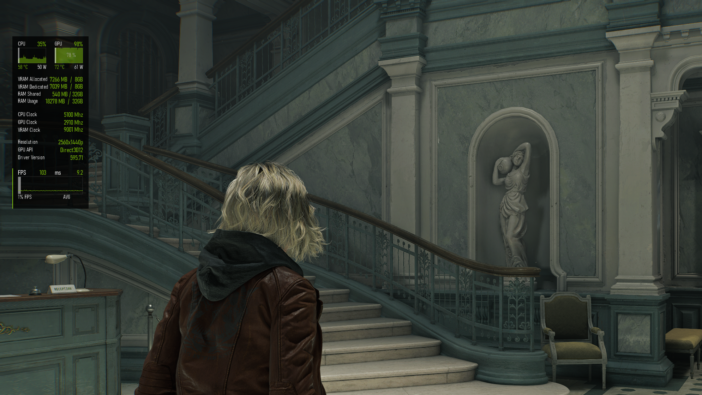

# Configurações do meu Windows 11

Minhas configurações, programas e debloat para deixar o Windows 11 do jeito que eu gosto, muito mais clean, sem IA slop de copilot e outras lixeiras da microsoft.

## 1. Chris Titus Tech's Windows Utility
> Link do git: https://github.com/christitustech/winutil

Este utilitário é uma compilação de tarefas do Windows que realizo em cada sistema Windows que utilizo. Ele visa agilizar instalações, remover programas desnecessários com ajustes, solucionar problemas com configurações e corrigir atualizações do Windows.


### Como Usar:

1. Abra o PowerShell ou Terminal (Windows 11) como administrador;
2. Cole o comando abaixo e precione ENTER;

```bash
irm "https://christitus.com/win" | iex
```
 > Aba "install" será os programas que serão baixados
 > Aba "Tweaks" será configurações do Windows
3. Clique na engrenagem > import;
4. Selecione o arquivo **"debloat-config.json"**;
5. Na aba install, clique em **"Install/Upgrade aplications"** e espera a conclusão;
6. Na aba Tweaks, clique em **"Run tweaks"** e espere a conclusão.
7. Pronto! =D
> Todos os programas, tweaks e configurações serão aplicados automaticamente.

> Atenção!
> Caso queria adicionar/tirar algum aplicativo ou opção, basta marcar/desmarcar o app ou tweak da sua preferência.


## 2. Spotify sem ad (SpotX)

> link do git: https://github.com/SpotX-Official/SpotX

1. Abra o PowerShell ou Terminal (Windows 11) como **administrador**;
2. Cole o comando abaixo;

```bash
iex "& { $(iwr -useb 'https://raw.githubusercontent.com/SpotX-Official/SpotX/refs/heads/main/run.ps1') } -new_theme"
```

3. Reponda as perguntas de acordo com suas preferências;
4. Aproveite! =D

## 3. Importando perfis do Afterbuner e Rivaturner (Overlay para jogos)

> Meu overlay bonitinho =D

1. Copie todos os arquivos da pasta **"./backups/afterburner"** e cole em **"C:\Program Files (x86)\MSI Afterburner\Profiles"**;
2. Copie todos os arquivos da pasta **"./backups/rivaturner"** e cole em **"C:\Program Files (x86)\RivaTuner Statistics Server\Profiles"**.
3. Pronto! =D
    > Atalho **END** para ativar/desativar overlay e **PgUp** e **PgDn** para alterar.


